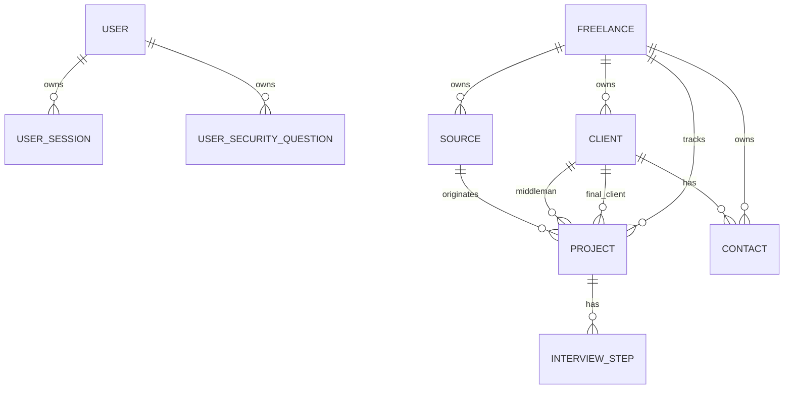

# Data Model Reference

This reference summarizes the current JPA domain model and its ownership rules. Hibernate currently creates and updates tables from entities in local and dev workflows, while the PostgreSQL init script handles database-level setup.

## Entity Relationship Overview

`User` and `Freelance` are both present today. `User` backs authentication and profile/security preferences. `Freelance` backs the opportunity-management workspace. Future account work should clarify and, if needed, consolidate the boundary between these two concepts.

## Shared Base Entity

All core entities extend `BaseEntity`, which provides:

- `id`
- `createdAt`
- `updatedAt`
- optimistic-locking `version`

Auditing is wired through Spring Data JPA annotations:

- `@CreatedDate`
- `@LastModifiedDate`
- `@EntityListeners(AuditingEntityListener.class)`

When adding entities, use `BaseEntity` unless there is a clear reason not to.

## User

Table: `users`

Purpose: authentication profile and account settings.

Important fields:

- first name and last name
- unique email
- phone, birth date, address, city
- avatar and bio
- company and position
- website, LinkedIn, GitHub
- skills and languages as element collections
- timezone and currency
- password hash
- last password change
- theme, language, date format, time format, default view
- notification preferences
- two-factor fields

Relationships:

- one user has many `UserSession` records
- one user has many `UserSecurityQuestion` records

Current caveat: the model stores fields for sessions, security questions, notification settings, and two-factor configuration, but the full production-grade flows are still roadmap/security backlog items.

## UserSession

Table: `user_sessions`

Purpose: session metadata for account activity and future active-session management.

Important fields:

- unique session id
- device
- browser
- location
- IP address
- last active timestamp
- current-session flag
- owning user

The helper `isActive()` treats a session as active when `lastActive` is within the past 24 hours.

## UserSecurityQuestion

Table: `user_security_questions`

Purpose: stores security-question prompts and hashed answers for a user.

Important fields:

- question
- answer hash
- owning user

Security note: security questions are often weaker than modern recovery flows. Treat this model as legacy-compatible or optional until the account recovery design is revisited.

## Freelance

Table: `freelances`

Purpose: the business profile that owns projects, clients, contacts, and sources.

Important fields:

- first name and last name
- unique email
- phone, birth date, address, city
- status: `FREELANCE`, `PORTAGE`, or `CDI`
- notice period in days
- availability date
- reversion rate
- income tax rate
- CV file path
- optional password hash

Relationships:

- one freelance has many projects
- one freelance has many clients
- one freelance has many contacts
- one freelance has many sources

Deletion behavior: child collections use cascade all. Be careful when deleting a freelance because it can remove the workspace owned by that profile.

## Project

Table: `projects`

Purpose: a tracked opportunity or mission.

Important fields:

- role
- status
- description
- tech stack
- daily rate
- work mode
- remote and onsite days per month
- advantages
- start date
- duration in months
- order renewal in months
- days per year
- document paths as an element collection
- link
- personal rating
- notes
- `isFavorite` flag (pins hot leads to the top of their Kanban column)

Relationships:

- required freelance owner
- required final client
- optional middleman client
- optional source
- many interview steps

Status values:

- `IDENTIFIED`
- `APPLIED`
- `INTERVIEW`
- `OFFER`
- `WON`
- `LOST`

Work mode values:

- `ONSITE`
- `REMOTE`
- `HYBRID`

Model helpers:

- `getTotalRevenue()`
- `isRemote()`
- `isHybrid()`
- `isOnsite()`

## Client

Table: `clients`

Purpose: final clients and intermediaries such as ESNs.

Important fields:

- company name
- address
- city
- domain
- `isFinal` flag
- notes
- `rating` (1-5 quality score, optional)
- `isBlacklisted` flag with `blacklistReason` (clients to avoid: payment delays, ghosting, bad process)
- freelance owner

Relationships:

- one client can own many projects as the final client
- one client can be attached to many projects as the middleman
- one client has many contacts

The `isFinal` field is the key product distinction between direct client and intermediary.

## Contact

Table: `contacts`

Purpose: named people associated with a client and freelancer.

Important fields:

- first name
- last name
- email
- phone
- notes
- client
- freelance owner

The model exposes `getFullName()` and falls back to first name when last name is empty.

## Source

Table: `sources`

Purpose: where an opportunity came from.

Important fields:

- name
- source type
- link
- listing flag
- popularity rating
- usefulness rating
- notes
- freelance owner

Relationships:

- one source can have many projects

Source type values:

- `JOB_BOARD`
- `SOCIAL_MEDIA`
- `EMAIL`
- `CALL`
- `SMS`

## InterviewStep

Table: `interview_steps`

Purpose: scheduled or completed stages in a recruitment process.

Important fields:

- title
- date
- status
- notes
- project

Step status values:

- `TO_PLAN`
- `PLANNED`
- `CANCELED`
- `WAITING_FEEDBACK`
- `VALIDATED`
- `FAILED`

Model helpers:

- `isCompleted()`
- `isFailed()`
- `isPlanned()`

## Element Collections

Current element collections:

- `user_skills`
- `user_languages`
- `project_documents`

Use element collections for simple owned scalar lists. Use real entities when values need identity, auditing, search, ownership, permissions, or relationships.

## Database Initialization

The Docker PostgreSQL init script is `database/init/01-init.sql`.

It currently:

- enables `uuid-ossp`
- adds a database comment
- leaves table creation to JPA/Hibernate
- leaves development sample data to Spring Boot seed files

Spring seed files:

- `data-local.sql`
- `data-dev.sql`

Test seed files:

- `test-data.sql`
- `project-test-data.sql`
- cleanup SQL files for test teardown

## Migration Reality

The current application relies on Hibernate `ddl-auto` behavior:

- `local`: `create-drop`
- default/dev/kubernetes style profiles: `update`

This is convenient during early development, but production should move to versioned migrations before data becomes valuable.

Recommended direction:

1. Introduce Flyway or Liquibase.
2. Baseline the current schema.
3. Stop using `ddl-auto: update` in deployed environments.
4. Add migration validation to CI.
5. Document rollback and restore procedures in [Operations](./operations.md).

## Ownership Rules

Practical ownership rules for new development:

- A project must belong to one freelance.
- A project must have one final client.
- A project may have one middleman client.
- A project may have one source.
- A contact belongs to one client and one freelance.
- A source belongs to one freelance.
- User account data should not be mixed into project ownership without clarifying the User/Freelance boundary.

## Related Guides

- [Features](./features.md)
- [Development](./development.md)
- [Security](./security.md)
- [ADR Index](./adr/README.md)
