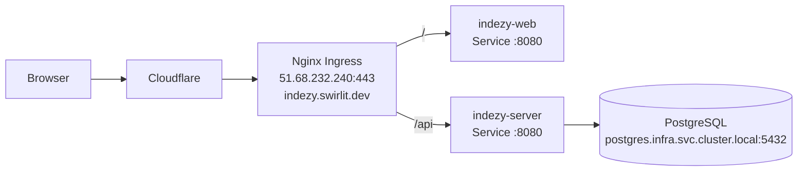

# Deployment Guide

Indezy is designed for the `ds-cluster` infrastructure: K3s, Jenkins, ArgoCD, Nexus, PostgreSQL, and Nginx Ingress.

## Runtime Topology



Production URL:

```text
https://indezy.swirlit.dev
```

Kubernetes namespace:

```text
application
```

ArgoCD application namespace:

```text
infra
```

## What The Manifests Configure

Manifests live in `deployments/`.

### Backend

File: `deployments/indezy-server.yaml`

Resources:

- `Secret`: `indezy-server-secret`
- `ConfigMap`: `indezy-server-config`
- `Deployment`: `indezy-server`
- `Service`: `indezy-server`

Important values:

- image: `nexus.swirlit.dev:5000/indezy/indezy-server:<tag>`
- profile: `kubernetes`
- datasource URL: `jdbc:postgresql://postgres.infra.svc.cluster.local:5432/indezy`
- datasource username: `indezy_user`
- datasource password from `indezy-server-secret`
- JWT secret from `indezy-server-secret`

The backend has an init container named `wait-for-db` that waits for the shared infrastructure PostgreSQL database before starting the application container.

### Frontend

File: `deployments/indezy-web.yaml`

Resources:

- `Deployment`: `indezy-web`
- `Service`: `indezy-web`

Important values:

- image: `nexus.swirlit.dev:5000/indezy/indezy-web:<tag>`
- container port: `8080`
- frontend is served by Nginx
- `/health` is expected to return a healthy response

### Ingress

File: `deployments/indezy-ingress.yaml`

The ingress routes:

- `/api` to `indezy-server:8080`
- `/` to `indezy-web:8080`

TLS:

- host: `indezy.swirlit.dev`
- secret: `indezy-swirlit-dev-tls`

Ingress annotations configure SSL redirect, request body size, and proxy timeouts.

### Database Setup Job

File: `deployments/indezy-db-setup.yaml`

Resources:

- `Secret`: `indezy-db-admin-credentials`
- `Job`: `indezy-db-setup`

The job runs as an ArgoCD PreSync hook. It:

- connects to shared infrastructure PostgreSQL as admin user `appuser`
- creates or updates `indezy_user`
- creates the `indezy` database if missing
- grants privileges
- enables `uuid-ossp`

The hook delete policy is `BeforeHookCreation`, so ArgoCD can recreate the hook job on future syncs.

## ArgoCD Application

File: `argocd/indezy-app.yaml`

The ArgoCD Application:

- name: `indezy`
- source repo: `https://github.com/chefzaid/indezy.git`
- target revision: `main`
- path: `deployments`
- destination namespace: `application`
- automated sync enabled
- prune enabled
- self-heal enabled
- `CreateNamespace=true`
- `ServerSideApply=true`

Bootstrap:

```bash
kubectl apply -f argocd/indezy-app.yaml
```

## One-Time Infrastructure Setup

### 1. Add DNS record in Cloudflare

| Type | Name | Value | Proxy |
|------|------|-------|-------|
| A | `indezy` | `51.68.232.240` | Proxied |

### 2. Copy TLS secret into `application`

```bash
kubectl get secret swirlit-dev-tls -n infra -o json \
  | jq 'del(.metadata.namespace, .metadata.resourceVersion, .metadata.uid, .metadata.creationTimestamp, .metadata.annotations, .metadata.managedFields) | .metadata.name = "indezy-swirlit-dev-tls" | .metadata.namespace = "application"' \
  | kubectl apply -f -
```

### 3. Apply ArgoCD application

```bash
kubectl apply -f argocd/indezy-app.yaml
```

## Jenkins Deployment Flow

File: `Jenkinsfile`

The pipeline runs in a Kubernetes agent with a Docker CLI container and mounted Docker socket.

Environment:

- registry: `nexus.swirlit.dev:5000`
- server image: `nexus.swirlit.dev:5000/indezy/indezy-server`
- web image: `nexus.swirlit.dev:5000/indezy/indezy-web`
- image tag: Jenkins build number

Stages:

1. Checkout.
2. Build and push backend image.
3. Build and push frontend image.
4. Update image tags in Kubernetes manifests.
5. Commit and push manifest changes.
6. Let ArgoCD sync the updated manifests.

Required Jenkins credentials:

- `nexus-docker-credentials`: username/password for Nexus Docker registry
- `git-credentials`: GitHub credentials that can push manifest updates

Create the Jenkins job as a Pipeline job:

- SCM: Git
- Repository: `https://github.com/chefzaid/indezy.git`
- Script Path: `Jenkinsfile`

## Image Build Model

Backend Dockerfile:

- builds with `eclipse-temurin:25-jdk-alpine`
- runs production with `eclipse-temurin:25-jre-alpine`
- uses a non-root `appuser`
- exposes port `8080`
- supports `development` and `production` stages

Frontend Dockerfile:

- builds with `node:26-alpine`
- serves production with `nginx:1.25-alpine`
- uses a non-root `nginxuser`
- exposes port `8080` in production
- supports `development` and `production` stages

## Configuration And Secrets

### ConfigMap values

`indezy-server-config` contains:

```text
SPRING_PROFILES_ACTIVE=kubernetes
SPRING_DATASOURCE_URL=jdbc:postgresql://postgres.infra.svc.cluster.local:5432/indezy
SPRING_DATASOURCE_USERNAME=indezy_user
```

### Secret values

`indezy-server-secret` contains:

- `DB_PASSWORD`
- `JWT_SECRET`

`indezy-db-admin-credentials` contains:

- `POSTGRES_ADMIN_PASSWORD`

Change all default base64 values before exposing the application.

Generate new values:

```bash
echo -n 'YOUR_DB_PASSWORD' | base64
echo -n 'YOUR_JWT_SECRET' | base64
echo -n 'YOUR_POSTGRES_ADMIN_PASSWORD' | base64
```

Edit:

- `deployments/indezy-db-setup.yaml`
- `deployments/indezy-server.yaml`

### Google Maps key

For commute support, add:

```yaml
- name: GOOGLE_MAPS_API_KEY
  value: "your-api-key-here"
```

Prefer a Kubernetes Secret instead of a plain manifest value when moving beyond a private/dev deployment.

## Health Checks

Backend probes currently reference:

```text
/api/actuator/health
```

Frontend probes reference:

```text
/health
```

Important current caveat: the technical backlog notes that Kubernetes probes reference `/api/actuator/health` while the backend actuator dependency may be missing. Before relying on rollout health gates, verify the endpoint exists in the running image.

Check manually:

```bash
kubectl -n application port-forward svc/indezy-server 8080:8080
curl http://localhost:8080/api/actuator/health
```

## Recommended Release Checklist

Before merge:

- backend tests pass
- frontend tests pass
- frontend production build passes
- manifest changes are reviewed
- no default secrets are introduced
- docs updated when deployment behavior changes

After Jenkins build:

- image tags in `deployments/*.yaml` match the Jenkins build number
- ArgoCD application is synced
- backend pod is ready
- frontend pod is ready
- ingress routes `/api` and `/`
- login and dashboard load from `https://indezy.swirlit.dev`

## Useful Commands

ArgoCD and Kubernetes status:

```bash
kubectl -n infra get application indezy
kubectl -n application get pods
kubectl -n application get svc
kubectl -n application get ingress
kubectl -n application describe deployment indezy-server
kubectl -n application describe deployment indezy-web
```

Logs:

```bash
kubectl -n application logs deploy/indezy-server
kubectl -n application logs deploy/indezy-web
kubectl -n application logs job/indezy-db-setup
```

Restart deployments:

```bash
kubectl -n application rollout restart deploy/indezy-server
kubectl -n application rollout restart deploy/indezy-web
```

## Related Guides

- [Operations](./operations.md)
- [Security](./security.md)
- [Development](./development.md)
- [ADR Index](./adr/README.md)
