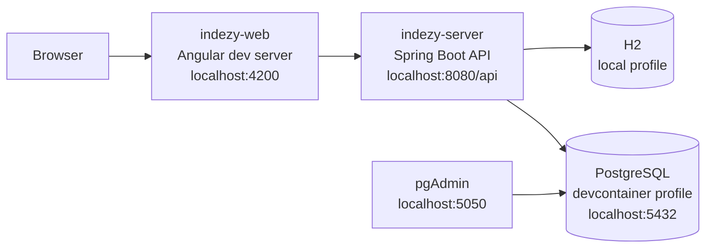

# Development Guide

This guide describes how to work on Indezy locally. It mirrors the repository as it exists today: a Spring Boot backend, an Angular frontend, Docker Compose services, and a Mask command runner.

## Local Topology

The local application is split into:

- `indezy-server`: Spring Boot API on `http://localhost:8080/api`
- `indezy-web`: Angular dev server on `http://localhost:4200`
- `postgres`: PostgreSQL on `localhost:5432` when using the dev profile
- `pgadmin`: optional database UI on `http://localhost:5050`



Two backend data modes are available:

- `local`: H2 in-memory database, seeded from `data-local.sql`
- `devcontainer`: PostgreSQL database, seeded from `data-dev.sql`

The frontend local environment points to `http://localhost:8080/api`. The production frontend uses the relative `/api` path so Nginx Ingress can route API traffic to the backend.

## Recommended Baseline

Install these tools on the host when not using the dev container:

- Java 25
- Node.js 26
- npm
- Docker and Docker Compose
- Mask

Install Mask with one of:

```bash
cargo install mask
npm install -g @jacobdeichert/mask
brew install mask
```

Run a quick environment check:

```bash
mask info
```

## Fastest Path To A Running App

### 1. Install dependencies

```bash
mask install
```

This runs Maven dependency resolution for `indezy-server` and `npm install` for `indezy-web`.

### 2. Start the local H2 stack

```bash
mask run-local
```

This builds both applications, starts the backend with the `local` profile, waits briefly, then starts the Angular dev server.

Local URLs:

- frontend: `http://localhost:4200`
- backend API: `http://localhost:8080/api`
- Swagger UI: `http://localhost:8080/api/swagger-ui.html`
- H2 console: `http://localhost:8080/api/h2-console`

## PostgreSQL Development Flow

Use this path when you want a database closer to deployed behavior.

```bash
docker-compose up -d postgres
mask run-indezy-server-dev
mask run-indezy-web-dev
```

Or use the combined command:

```bash
mask run-dev
```

The `devcontainer` backend profile connects to:

```text
jdbc:postgresql://postgres:5432/indezy
```

When running the backend directly from the host, make sure the hostname and profile match how the process can reach PostgreSQL. The Mask command is optimized for the Docker/devcontainer naming model.

## Docker Compose Profiles

The root `docker-compose.yml` uses profiles:

- `dev`: development backend and Angular dev server
- `prod`: production-style backend and Nginx-served frontend
- `admin`: pgAdmin
- `devcontainer`: VS Code dev container support

Examples:

```bash
docker-compose --profile dev up
docker-compose --profile prod up
docker-compose --profile admin up -d pgadmin
docker-compose down
```

The PostgreSQL service is shared by development and production-style local flows.

## VS Code Dev Container

The dev container is configured in `.devcontainer/devcontainer.json`.

It provides:

- Java 25 runtime configuration
- Maven settings
- forwarded ports for backend, frontend, PostgreSQL, and pgAdmin
- automatic `postgres` and `pgadmin` services
- a post-create hook through `.devcontainer/post-create.sh`

Start it with VS Code's "Reopen in Container" command. The workspace folder inside the container is `/workspace`.

Forwarded ports:

- `8080`: Spring Boot backend
- `4200`: Angular frontend
- `5432`: PostgreSQL
- `5050`: pgAdmin

## Environment Files

The root `.env.example` documents Docker Compose values:

```bash
POSTGRES_DB=indezy
POSTGRES_USER=indezy_user
POSTGRES_PASSWORD=change_this_password_in_production
POSTGRES_PORT=5432
BACKEND_PORT=8080
FRONTEND_PORT=4200
PGADMIN_EMAIL=admin@indezy.com
PGADMIN_PASSWORD=change_this_password_in_production
PGADMIN_PORT=5050
```

Copy it when you need local overrides:

```bash
cp .env.example .env
```

Do not commit `.env`.

## Backend Configuration

Important backend files:

- `indezy-server/src/main/resources/application.yml`
- `indezy-server/src/main/resources/application-local.yml`
- `indezy-server/src/main/resources/application-devcontainer.yml`
- `indezy-server/src/main/resources/application-kubernetes.yml`

Default API context path:

```yaml
server:
  servlet:
    context-path: /api
```

Default JWT settings:

```yaml
jwt:
  secret: ${JWT_SECRET:indezy-super-secret-key-change-in-production}
  expiration: 86400000
```

Local H2 profile:

- uses `jdbc:h2:mem:indezy`
- enables the H2 console
- loads `data-local.sql`
- recreates schema with `ddl-auto: create-drop`

Devcontainer profile:

- uses PostgreSQL service `postgres`
- loads `data-dev.sql`
- uses `ddl-auto: update`

## Frontend Configuration

Important frontend files:

- `indezy-web/src/environments/environment.ts`
- `indezy-web/src/environments/environment.prod.ts`
- `indezy-web/src/app/app.routes.ts`
- `indezy-web/src/app/app.config.ts`

Local API URL:

```ts
apiUrl: 'http://localhost:8080/api'
```

Production API URL:

```ts
apiUrl: '/api'
```

Top-level routes:

- `/login`
- `/register`
- `/dashboard`
- `/profile`
- `/projects`
- `/clients`
- `/contacts`
- `/sources`
- `/404`
- `/error`

Protected routes use `authGuard`. API requests get a bearer token from the auth interceptor when a token is available.

## Daily Commands

High-level commands:

```bash
mask install
mask build
mask test
mask test-coverage
mask run-local
mask run-dev
mask status
mask logs
mask stop
```

Backend commands:

```bash
cd indezy-server
./mvnw dependency:go-offline
./mvnw spring-boot:run -Dspring-boot.run.profiles=local
./mvnw spring-boot:run -Dspring-boot.run.profiles=devcontainer
./mvnw test
./mvnw clean package -DskipTests
```

On Windows, use `mvnw.cmd` instead of `./mvnw`.

Frontend commands:

```bash
cd indezy-web
npm install
npm start
npm run build
npm test -- --watch=false --browsers=ChromeHeadless
npm run lint
```

## Google Maps API Key

Commute-time sorting uses the Google Maps Distance Matrix API.

1. Create or select a Google Cloud project.
2. Enable the Distance Matrix API.
3. Create an API key.
4. Restrict the key to the Distance Matrix API and to the server IP when possible.
5. Export the key before starting the backend:

```bash
export GOOGLE_MAPS_API_KEY=your-api-key-here
```

The backend reads it through:

```yaml
google:
  maps:
    api-key: ${GOOGLE_MAPS_API_KEY:}
```

Without a valid key, the app still returns projects, but commute time and distance data are omitted.

## Adding Backend Features

The backend follows a conventional layered structure:

- `controller`: HTTP endpoints
- `service`: business logic
- `repository`: JPA persistence
- `model`: entities
- `dto`: API request and response shapes
- `mapper`: MapStruct conversions
- `exception`: API error handling
- `config`: security, CORS, OpenAPI, and data initialization

When adding a feature:

1. Start from the domain model and relationships.
2. Add or update DTOs rather than exposing entities directly.
3. Add MapStruct mappings for request and response conversion.
4. Keep controller methods thin.
5. Put transaction-sensitive behavior in services.
6. Add focused unit tests and integration coverage for user-visible workflows.

## Adding Frontend Features

The frontend uses Angular standalone components and lazy route loading.

When adding a feature:

1. Add route definitions in the relevant `*.routes.ts` file.
2. Keep API calls in services under `src/app/services`.
3. Keep shared UI in `src/app/shared/components`.
4. Add models under `src/app/models`.
5. Use translation keys in both `fr.json` and `en.json`.
6. Prefer Angular Material controls already used in the app.
7. Add tests beside the service, guard, interceptor, or component being changed.

## Troubleshooting

### Backend starts but frontend calls fail

Check that the backend is available:

```bash
curl http://localhost:8080/api/swagger-ui.html
```

Then verify `indezy-web/src/environments/environment.ts` still points to `http://localhost:8080/api`.

### PostgreSQL profile cannot connect

Check the container:

```bash
docker-compose ps postgres
docker-compose logs postgres
```

If the backend is running outside Docker, `postgres` may not resolve as a hostname. Use the H2 local profile or adjust the datasource URL for host-based access.

### `mask status` reports health check failure

The status command checks `/api/actuator/health`. If the actuator dependency is not present or the endpoint is not enabled, the port can be running while the health request fails. This is tracked in the technical backlog.

## Related Guides

- [Features](./features.md)
- [Testing](./testing.md)
- [Data Model](./data-model.md)
- [Deployment](./deployment.md)
- [Security](./security.md)
