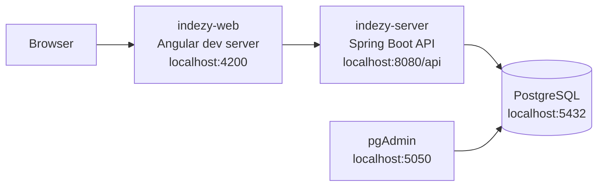

# Development Guide

This guide describes how to work on Indezy locally. It mirrors the repository as it exists today: a Spring Boot backend, an Angular frontend, Docker Compose services, and a Mask command runner.

## Local Topology

The local application is split into:

- `indezy-server`: Spring Boot API on `http://localhost:8080/api`
- `indezy-web`: Angular dev server on `http://localhost:4200`
- `postgres`: PostgreSQL on `localhost:5432`
- `pgadmin`: optional database UI on `http://localhost:5050`


```mermaid
flowchart LR
    browser[Browser] --> web[indezy-web\nAngular dev server\nlocalhost:4200]
    web --> api[indezy-server\nSpring Boot API\nlocalhost:8080/api]
    api --> pg[(PostgreSQL\nlocalhost:5432)]
    pgadmin[pgAdmin\nlocalhost:5050] --> pg
```

PostgreSQL is the only local application database. Normal startup preserves its data.
The explicit `seed` profile is reserved for `mask db-reset`, which recreates the schema
and loads `data-dev.sql`. H2 remains test-only.

The frontend local environment points to `http://localhost:8080/api`. The production frontend uses the relative `/api` path so Nginx Ingress can route API traffic to the backend.

## Recommended Baseline

Install these tools on the host when not using the dev container:

- Java 25
- Node.js 26
- npm
- Docker and Docker Compose
- Mask

Install Mask with one of:

```bash
cargo install mask
npm install -g @jacobdeichert/mask
brew install mask
```

Run a quick environment check:

```bash
mask info
```

## Fastest Path To A Running App

### 1. Install dependencies

```bash
mask install
```

This runs Maven dependency resolution for `indezy-server` and `npm install` for `indezy-web`.

### 2. Create a sample database

```bash
mask db-reset
```

This destructive command starts PostgreSQL, recreates the application schema, loads a
large sample dataset, and prints the sample account credentials. It first stops local
services using the configured PostgreSQL, backend, or frontend ports.

### 3. Start the local stack

```bash
mask run
```

This builds both applications, starts PostgreSQL and the backend, then starts the Angular
development server. If the configured PostgreSQL, backend, or frontend port is already
occupied, `mask run` stops the existing container or listener first. Later backend restarts preserve changes made
to the sample data.

Local URLs:

- frontend: `http://localhost:4200`
- backend API: `http://localhost:8080/api`
- Swagger UI: `http://localhost:8080/api/swagger-ui.html`

## Running One Application Component

Start only the backend and PostgreSQL:

```bash
mask run-indezy-server
```

Start only the frontend:

```bash
mask run-indezy-web
```

Inside the VS Code dev container, the `devcontainer` profile connects to:

```text
jdbc:postgresql://postgres:5432/indezy
```

## Docker Compose Profiles

`infra/compose/compose.yaml` uses profiles:

- `dev`: development backend and Angular dev server
- `prod`: production-style backend and Nginx-served frontend
- `admin`: pgAdmin
- `devcontainer`: VS Code dev container support

Examples:

```bash
docker compose -f infra/compose/compose.yaml --profile dev up
docker compose -f infra/compose/compose.yaml --profile prod up
docker compose -f infra/compose/compose.yaml --profile admin up -d pgadmin
docker compose -f infra/compose/compose.yaml down
```

The PostgreSQL service is shared by development and production-style local flows.

## VS Code Dev Container

The dev container is configured in `.devcontainer/devcontainer.json`.

It provides:

- Java 25 runtime configuration
- Maven settings
- forwarded ports for backend, frontend, PostgreSQL, and pgAdmin
- automatic `postgres` and `pgadmin` services
- a post-create hook through `.devcontainer/post-create.sh`

Start it with VS Code's "Reopen in Container" command. The workspace folder inside the container is `/workspace`.

Forwarded ports:

- `8080`: Spring Boot backend
- `4200`: Angular frontend
- `5432`: PostgreSQL
- `5050`: pgAdmin

## Environment Files

The root `.env.example` documents Docker Compose values:

```bash
POSTGRES_DB=indezy
POSTGRES_USER=indezy_user
POSTGRES_PASSWORD=change_this_password_in_production
POSTGRES_PORT=5432
BACKEND_PORT=8080
FRONTEND_PORT=4200
PGADMIN_EMAIL=admin@indezy.com
PGADMIN_PASSWORD=change_this_password_in_production
PGADMIN_PORT=5050
```

Copy it when you need local overrides:

```bash
cp .env.example .env
```

Do not commit `.env`.

## Backend Configuration

Important backend files:

- `indezy-server/src/main/resources/application.yml`
- `indezy-server/src/main/resources/application-devcontainer.yml`
- `indezy-server/src/main/resources/application-seed.yml`
- `indezy-server/src/main/resources/application-kubernetes.yml`

Default API context path:

```yaml
server:
  servlet:
    context-path: /api
```

Default JWT settings:

```yaml
jwt:
  secret: ${JWT_SECRET:indezy-super-secret-key-change-in-production}
  expiration: 86400000
```

Default local configuration:

- connects to PostgreSQL on `localhost:${POSTGRES_PORT}`
- preserves the schema and data with `ddl-auto: update`
- reads the database name and credentials from `POSTGRES_*` environment variables

Devcontainer profile:

- uses PostgreSQL service `postgres`
- uses `ddl-auto: update`

Seed profile:

- is invoked only through `mask db-reset`
- recreates the PostgreSQL schema with `ddl-auto: create`
- loads `data-dev.sql` after Hibernate creates the tables

## Frontend Configuration

Important frontend files:

- `indezy-web/src/environments/environment.ts`
- `indezy-web/src/environments/environment.prod.ts`
- `indezy-web/src/app/app.routes.ts`
- `indezy-web/src/app/app.config.ts`

Local API URL:

```ts
apiUrl: 'http://localhost:8080/api'
```

Production API URL:

```ts
apiUrl: '/api'
```

Top-level routes:

- `/login`
- `/register`
- `/dashboard`
- `/profile`
- `/projects`
- `/clients`
- `/contacts`
- `/sources`
- `/404`
- `/error`

Protected routes use `authGuard`. API requests get a bearer token from the auth interceptor when a token is available.

## Daily Commands

High-level commands:

```bash
mask install
mask build
mask test
mask test-coverage
mask db-reset
mask run
mask run-indezy-server
mask run-indezy-web
mask status
mask logs
mask stop
```

Backend commands:

```bash
cd indezy-server
./mvnw dependency:go-offline
./mvnw spring-boot:run
./mvnw test
./mvnw clean package -DskipTests
```

On Windows, use `mvnw.cmd` instead of `./mvnw`.

Frontend commands:

```bash
cd indezy-web
npm install
npm start
npm run build
npm test -- --watch=false --browsers=ChromeHeadless
npm run lint
```

## Google Maps API Key

Commute-time sorting uses the Google Maps Distance Matrix API.

1. Create or select a Google Cloud project.
2. Enable the Distance Matrix API.
3. Create an API key.
4. Restrict the key to the Distance Matrix API and to the server IP when possible.
5. Export the key before starting the backend:

```bash
export GOOGLE_MAPS_API_KEY=your-api-key-here
```

The backend reads it through:

```yaml
google:
  maps:
    api-key: ${GOOGLE_MAPS_API_KEY:}
```

Without a valid key, the app still returns projects, but commute time and distance data are omitted.

## Adding Backend Features

The backend follows a conventional layered structure:

- `controller`: HTTP endpoints
- `service`: business logic
- `repository`: JPA persistence
- `model`: entities
- `dto`: API request and response shapes
- `mapper`: MapStruct conversions
- `exception`: API error handling
- `config`: security, CORS, OpenAPI, and data initialization

When adding a feature:

1. Start from the domain model and relationships.
2. Add or update DTOs rather than exposing entities directly.
3. Add MapStruct mappings for request and response conversion.
4. Keep controller methods thin.
5. Put transaction-sensitive behavior in services.
6. Add focused unit tests and integration coverage for user-visible workflows.

## Adding Frontend Features

The frontend uses Angular standalone components and lazy route loading.

When adding a feature:

1. Add route definitions in the relevant `*.routes.ts` file.
2. Keep API calls in services under `src/app/services`.
3. Keep shared UI in `src/app/shared/components`.
4. Add models under `src/app/models`.
5. Use translation keys in both `fr.json` and `en.json`.
6. Prefer Angular Material controls already used in the app.
7. Add tests beside the service, guard, interceptor, or component being changed.

## Troubleshooting

### Backend starts but frontend calls fail

Check that the backend is available:

```bash
curl http://localhost:8080/api/swagger-ui.html
```

Then verify `indezy-web/src/environments/environment.ts` still points to `http://localhost:8080/api`.

### PostgreSQL cannot connect

Check the container:

```bash
docker compose -f infra/compose/compose.yaml ps postgres
docker compose -f infra/compose/compose.yaml logs postgres
```

The host-based Mask commands connect to `localhost`. The `devcontainer` profile uses the
Docker service hostname `postgres`; do not pass that profile when starting Maven on the host.

### `mask status` reports health check failure

The status command checks `/api/actuator/health`. If the actuator dependency is not present or the endpoint is not enabled, the port can be running while the health request fails. This is tracked in the technical backlog.

## Related Guides

- [Features](./features.md)
- [Testing](./testing.md)
- [Data Model](./data-model.md)
- [Deployment](./deployment.md)
- [Security](./security.md)
